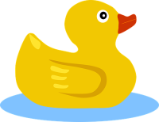

# Tutorial 3 - Linear Algebra Refresher

## Part 1 - Tutorial Slides
- See the lecture slides under /documentation/linear_algebera_tutorial.pdf 

## Part 2 - ROS Coordinate Transform Exercise
RoboDuck is on its first deployment in the ocean. We have a map of the ocean seabed but RoboDuck lacks a camera to visualize how the seabed would appear at its current location. Your task is to complete the matrix transformations necessary for RoboDuck to extract an image cutout from the map that would correspond to its view of the seabed. We will compare this implementation against what a true camera generates.
  


### Lab Computer ROS Setup (Skip if ROS already installed) 
__NOTE:__ This setup process is for the 3120 Trottier lab computers which already have ROS Melodic installed on the system. Please refer to  [ROS Melodic Installation](http://wiki.ros.org/melodic/Installation/Ubuntu) for Ubuntu 18 or [ROS Kinetic Installation](http://wiki.ros.org/kinetic/Installation) for Ubuntu 16 for installation on your own machine.
- Source the ros setup script:

```shell script
echo "source /opt/ros/melodic/setup.bash" >> ~/.bashrc
source ~/.bashrc
```

- Make your catkin workspace: 

```shell script
cd ~
mkdir -p catkin_ws/src
``` 

- If this is the first time building the catkin workspace, `~/catkin_ws/devel/setup.bash` should be included in your `.bashrc`:   
```shell script
echo "source ~catkin_ws/devel/setup.bash" >> ~/.bashrc
source ~/.bashrc
```

- To verify that everything is setup accordingly, you can inspect the contents of your ~/.bashrc file to ensure the two lines: `source /opt/ros/melodic/setup.bash` and `source ~catkin_ws/devel/setup.bash` are present
- Place package code in the __catkin_ws/src__ folder. We will use this repository for that purpose:

```shell script
cd ~/catkin_ws/src
git clone https://github.com/comp417-fall2019-tutorials/linear_algebra_tutorial.git
```

- Build your catkin_ws folder. Navigate back to the catkin_ws folder and execute the `catkin_make` command 
```shell script
cd ~/catkin_ws
catkin_make
```

### Running the Project
- Launch the Gazebo world simulator with: 

```shell script
roslaunch linear_algebra_tutorial world.launch
```

__Expected Output:__


- You can move the duck around with the `keyboard_teleop.py` node

```shell script
rosrun linear_algebra_tutorial teleop_twist_keyboard.py
```

### Tasks to Complete 
- Edit the **TODO** sections in `python/camera_view_node.py`
- You need to fill out the values in the transformation matrices necessary to map from the reef plane image (origin at the bottom-left corner) to the duck's camera frame.
- Some additional matrix transformations are required for the camera model but these have already been implemented for you. 

__Needed Dimensions__
- The seabed is 2m below the water surface
- The seabed plane is 30m x 30m 
- The duck's current (x,y,theta) pose state is given to you
    - The pose is measured from the center of the gazebo world
    - Conversely the origin of the reef plane is at the bottom left of the image plane
    - This gives a total translation of: x_offset = 15 + x, y_offset = 15 + y for the duck versus image plane origin
- Finally, the camera frame of the duck is (0.2, 0) in front of the duck's pose

__3 Matrix Transformations to Complete:__
- Translation between duck frame and duck camera frame 
- Rotation for duck yaw
- Translation between seabed origin and duck frame


### Check Your Answer 
- Run the `camera_view_node.py` file: 
```shell script
python python/camera_view_node.py
``` 
__OR__
```shell script
roslaunch linear_algebera_tutorial camera_view_node.py
```

- Open **rqt_image_view** and compare your generated image using matrix transformations with the image generated from the true camera.
```shell script 
# Open rqt_image_view in console:
rqt_image_view
```
- In the drop-down in **rqt_image_view** select between:
    - **camera/image_true** for the true image
    - **camera/generated** for your generated image 


  


